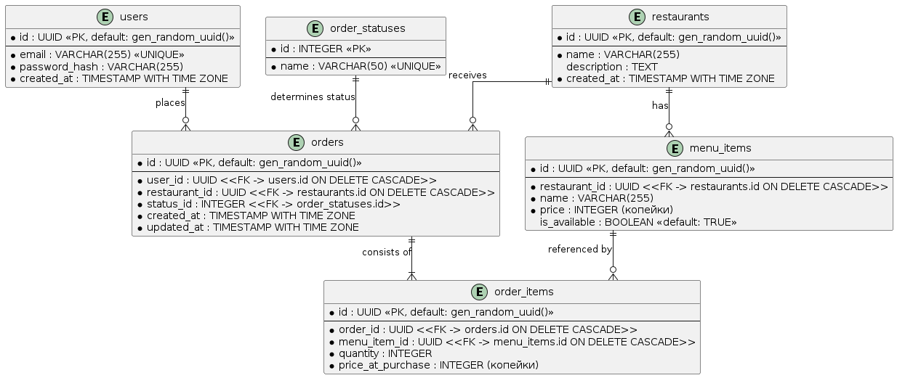

# Kitchens

Distributed order management and kitchen simulation service for restaurants. The service is built using Apache Kafka and gRPC.

## Tech Stack

* **Language:** Go 1.25
* **DBMS:** PostgreSQL 15 (`pgxpool`, Query Builder `Masterminds/squirrel`, migrations via `golang-migrate`)
* **Caching:** Redis 7 (`go-redis`, Cache-Aside pattern for the menu catalog, 5 min TTL, graceful fallback to the database)
* **Message Broker:** Apache Kafka 3.7
* **Inter-service Communication:** gRPC
* **Configuration and Logging:** `log/slog` (structured JSON logging)
* **Testing and Mocking:** `testing`, `httptest`, `redismock`, `mockery`
* **Containerization:** Docker (multi-stage build), Docker Compose (orchestration of API, database, Redis, Kafka, and simulator)

## Project Architecture

* **Business Logic Layer (`internal/service`)**: Validates boundary conditions, validates input data, verifies that menu items belong to a single restaurant, checks item availability, ensures order lifecycle correctness, and publishes events to the message broker.
* **Data Access Layer (`internal/repo`)**: Isolates queries to PostgreSQL via a **`pgxpool`** connection pool using dynamic SQL construction with **`Squirrel`**, with caching via Redis.
* **Event (`internal/infrastructure/kafka`)**: Publishes events to a topic partitioned by restaurants.
* **Kitchen Simulator (`cmd/simulator`)**: Standalone partner microservice. Operates as a Kafka Consumer: reads from the broker and triggers gRPC calls.
* **Graceful Shutdown**: Both services listen for system signals and gracefully release database connections and network sockets with a timeout.

## Database Schema

The database schema is normalized: order statuses are extracted into a separate table, and prices are fixed in integer kopecks.



### Database Implementation Details

* **Status Lookup Table (`order_statuses`)**: `1: Created`, `2: Accepted`, `3: Cooking`, `4: Ready`, `5: Cancelled`.
* **Purchase Price Capture (`price_at_purchase`)**: Records the price of a menu item in kopecks at the moment the order is placed, isolating the receipt from future changes in the menu catalog.
* **Indexes**: To accelerate lookups and prevent full table scans, indexes are created on foreign keys and relationships: by restaurant in the menu items table, by user and restaurant in the orders table, and by order in the order items table.

---

## API Specification

Routes are synchronized with the registration in the `mux` of the `cmd/kitchens/main.go` file:

| Method | Path | Required Headers / Query | Description | Response Codes |
| --- | --- | --- | --- | --- |
| `GET` | `/restaurants` | — | Get a list of all restaurants (sorted by name) | `200`, `500` |
| `GET` | `/restaurants/{id}/menu` | — | Get the menu of available items for a restaurant | `200`, `400`, `500` |
| `POST` | `/orders` | `X-User-ID: <UUID>` | Create a new order with cart validation | `201`, `400`, `401`, `500` |
| `GET` | `/orders/{id}` | — | Get the status and items of a specific order | `200`, `400`, `404` |
| `GET` | `/restaurant/orders` | `X-Restaurant-ID: <UUID>`, `?status_id=` *(opt)* | Get restaurant orders filtered by status | `200`, `400`, `401`, `500` |
| `PATCH` | `/restaurant/orders/{id}/status` | `X-Restaurant-ID: <UUID>` | Update order status by the restaurant kitchen | `200`, `400`, `401`, `500` |

### gRPC API (`:9000`)

* `rpc GetOrders(GetOrdersRequest) returns (GetOrdersResponse)` — Retrieve kitchen orders with an optional status filter.
* `rpc UpdateOrderStatus(UpdateOrderStatusRequest) returns (UpdateOrderStatusResponse)` — Update order status with transition validation.

---

## Quick Start

The project is configured to run from scratch via Docker Compose.

### Running Services and Database

```bash
docker compose up --build

```

After startup, the following containers will be deployed:

* **Main API Service (`kitchens-api`)**: Port `:8000` (configured via the `PORT` environment variable).
* **gRPC Server**: Port `:9000`.
* **Kitchen Simulator (`kitchens-simulator`)**: Consumer service processing orders in the background.
* **PostgreSQL Database**: Port `:5432`.
* **Redis**: Port `:6380`.
* **Apache Kafka**: Port `:9092`.
* **Migrations Container (`migrate`)**: Automatically applies tables and seeds for restaurants and menus.

---

### Running Tests and Coverage Calculation

To run in an isolated Docker environment:

```bash
docker compose -p e2e -f docker-compose.e2e.yaml run --rm tests sh -c "go test -coverpkg=./internal/... -coverprofile=/tmp/cover.out ./internal/... && go tool cover -func=/tmp/cover.out"

```

Final code coverage result: over 80%.

### Linters

The project is fully validated using `golangci-lint` (includes `errcheck`, `govet`, `ineffassign`, `staticcheck`, `unused`, `misspell`, `gofmt` autoformatting, and `goimports` import grouping):

```bash
golangci-lint run ./...

```